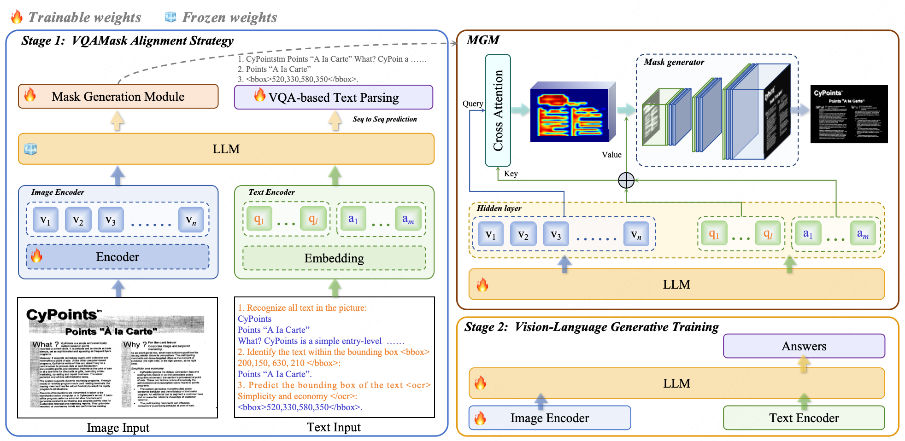

<div align="center">

# Marten: Visual Question Answering with Mask Generation for Multi-modal Document Understanding(CVPR 2025)

</div>

<!-- ##  -->


## Introduction

Paper (🚀🚀🚀 **Accepted by CVPR2025** 🚀🚀🚀): 

comming soon

Pipeline:

<div align="center">

</div>


## Installation

Ensure you have Python 3.8 or higher installed in your environment.

```bash
git clone https://github.com/Token-family/Marten.git
cd Marten
pip install -r requirements.txt

